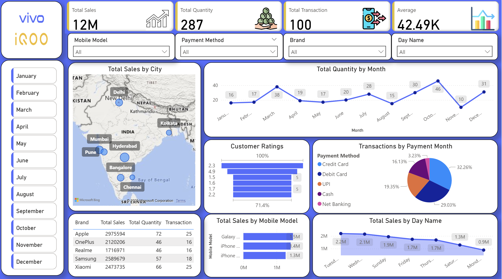

# Mobile Sales Dashboard – Power BI

## 📊 Project Overview

An interactive Power BI dashboard developed to analyze mobile phone sales performance across different brands, models, regions, and time periods.

The dashboard provides a clear overview of sales performance and helps identify trends and patterns using interactive charts, KPIs, and filters.

## 🎯 Objective

The objective of this project is to analyze mobile sales data and understand:

- Overall sales performance
- Revenue and units sold
- Brand and model performance
- Regional sales performance
- Monthly and yearly sales trends
- Top-performing mobile brands and models

## 🛠️ Tools & Technologies

- Power BI
- DAX
- Microsoft Excel
- Data Visualization

## 🔄 Data Preparation

The dataset was prepared and transformed before creating the dashboard.

Key steps included:

- Data cleaning
- Data transformation
- Data type checking
- Handling data inconsistencies
- Preparing data for analysis and visualization

## 📈 Dashboard Features

The dashboard includes:

- Total Sales analysis
- Revenue overview
- Units Sold analysis
- Brand-wise sales comparison
- Model-wise performance
- Regional performance analysis
- Monthly and yearly sales trends
- Interactive charts and filters

## 🔍 Key Analysis

The dashboard helps analyze:

- Which brands and models contribute to sales
- Regional differences in mobile sales
- Sales performance over time
- Revenue and units sold across different segments
- Top-performing products and brands

## 🖼️ Dashboard Preview

## 📁 Files in this Repository

- `Dashboard_view.png` — Dashboard screenshot
- `Mobile_Sales_Dataset.xlsx` — Dataset used for analysis
- `Mobile_Sales_Data_in_Power_BI.pbix` — Power BI dashboard file
- `README.md` — Project documentation

## 📌 Project Type

Data Analytics | Business Intelligence | Data Visualization

## 👩‍💻 Author

**Saziya Naushad**

Data Analyst | SQL | Power BI | Excel | Python

